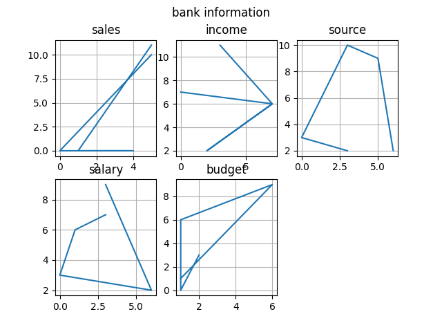
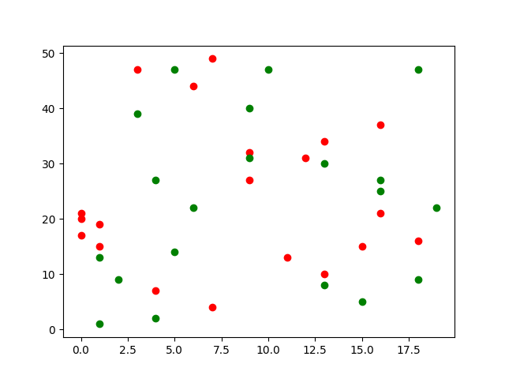
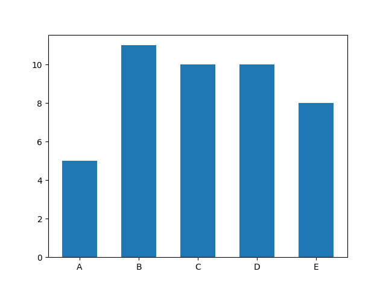
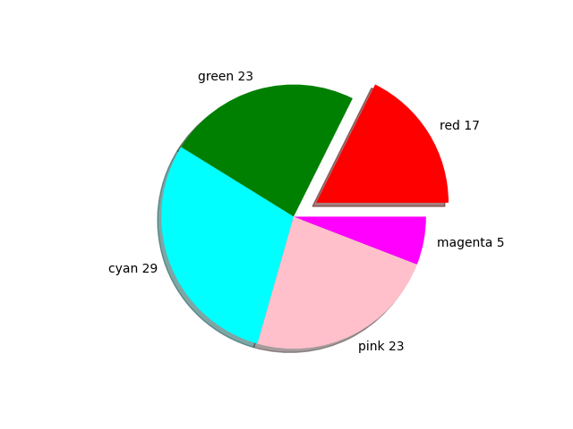

# Python Visualization

### install matplotlib

```
$ pip3 install matplotlib
```

### check version

```
import matplotlib
print(matplotlib._version__)
```

---

## Visualization

### line


### subplot



### scatter



### bar



### pie chart



---
